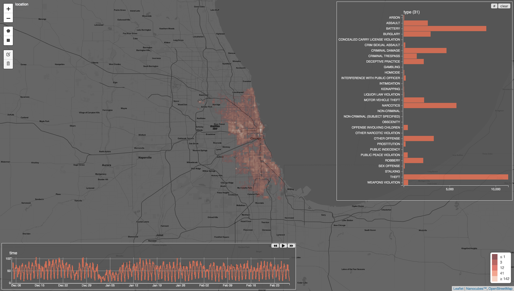

# Nanocubes: an in-memory data structure for spatiotemporal data cubes

Nanocubes are a fast data structure for in-memory data cubes developed at the Information Visualization department at [AT&T Labs Research](http://www.research.att.com). Visualizations powered by nanocubes can be used to explore datasets with billions of elements at interactive rates in a web browser, and in some cases nanocubes uses sufficiently little memory that you can run a nanocube in a modern-day laptop.

# About this branch

This branch (`v4`) contains a new implementation of Nanocubes in the C programming language. The goal with this new implementation was to get a much finer control in all aspects of the data structure and specially on its memory aspects (allocation, layout). In our original C++ template-based implementation of Nanocubes (up to version 3.3), we implemented the Nanocube data structure on top of C++ STL (standard library) and while this was a reasonable solution at the time, it had some important downsides: (1) complex serialization which made it hard to save/load Nanocube into files; (2) variations in the internal memory layout of a Nanocube based on the specific STL implementation we used.

Here is a link to the new [API](/api/README.md)

# Compiling on Linux or Mac

```shell
# Dependencies for Ubuntu 18.04
# sudo apt install build-essential curl unzip python-pip
#
# Dependencies for Mac OS X 10.13.4
# XCode

# get the v4 branch
curl -L -O https://github.com/laurolins/nanocube/archive/v4.zip
unzip v4.zip
cd nanocube-4

./configure --with-polycover --prefix=$(pwd)/install
make
make install

# Test if nanocubes is working
./install/bin/nanocube
```

Notes on the `nanocube` executable

```shell
#
# The `nanocube` executable when compiled with `--with-polycover` depends on two 
# dynamic libraries that are also generated when we compile the program:
#
#     libnanocube_app.(so|dylib)
#     libpolycover.(so|dylib)
#
# These dynamic libraries are explicitly linked by the main `nanocube` executable
# and only work if their relative path to the main `nanocube` executable
# matches one of these paths
#
#     .                            <--- same directory as the executable
#     ../lib                       <--- one level above and inside lib
#     .libs                        <--- inside .libs at the same dir as the exec
#
# If you want to install the nanocubes in another folder, change the `--prefix`
# path in the configure command.
#
#     make distclean
#     ./configure --with-polycover --prefix=INSTALL_FOLDER
#
```

# Viewer

```shell
# Setup the environment variables needed to run the Nanocubes binary just installed
. setenv.sh

cd data/
nanocube create <(gunzip -c crime50k.csv.gz) crime50k.map crime50k.nanocube
nanocube serve 51234 crime=crime50k.nanocube &

cd ../

# If you need to install pip (e.g. on MacOS)
# python <(curl https://bootstrap.pypa.io/get-pip.py) --user

python -m pip install --user requests future

# Setup a web viewer on port 8000 for the crimes nanocube previously opened 
# on port 51234.
#
# Parameters:
#     -s         nanocube backend server (any http heachable machine)
#     --ncport   nanocube backend port
#     -p         port of the webviewer to be opon in the localhost
#

./scripts/ncwebviewer-config -s http://localhost --ncport 51234 -p 8000

```

Zoom into the Chicago region to see a heatmap of crimes.




# Extra

For more advanced information follow this link: [extra](/EXTRA.md)

